# Батраков Никита / Batrakov Nikita

## 1. Платформа для размещения статей (Angular), 2022
### Репозиторий проекта: **[платформа для размещения статей на Angular](https://github.com/batnd/spa-web-platform)**

### Описание
Платформа для размещения и просмотра статей, выполненная на **фреймворке Angular**.  
С возможностями, выполненными задачами, внешним видом и **технологиями** можно ознакомиться в репозитории проекта.

### Внешний вид
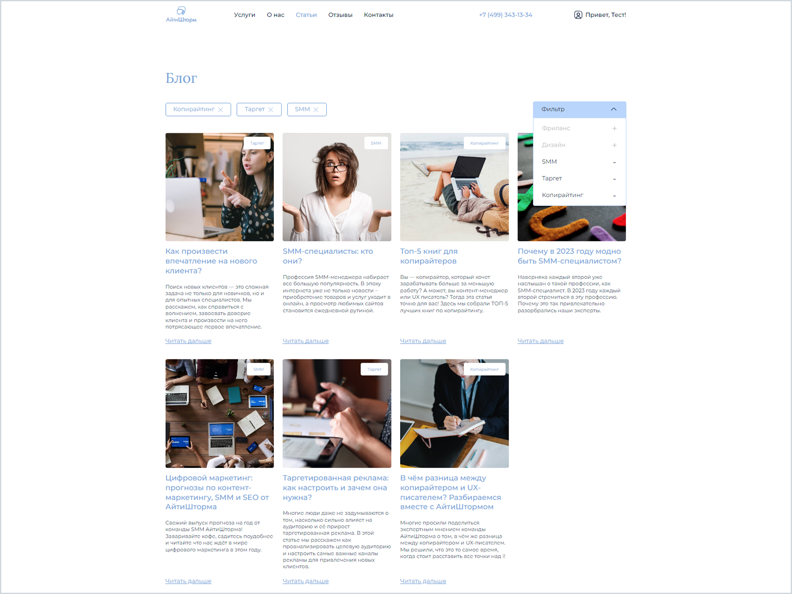

## 2. Интернет-магазин домашних растений (Angular), 2022
### Репозиторий проекта: **[интернет-магазин на Angular](https://github.com/batnd/spa-plants-shop)**

### Описание
Интернет-магазин домашних растений, выполненный на **фреймворке Angular**.  
С возможностями, выполненными задачами, внешним видом и **технологиями** можно ознакомиться в репозитории проекта.

### Внешний вид
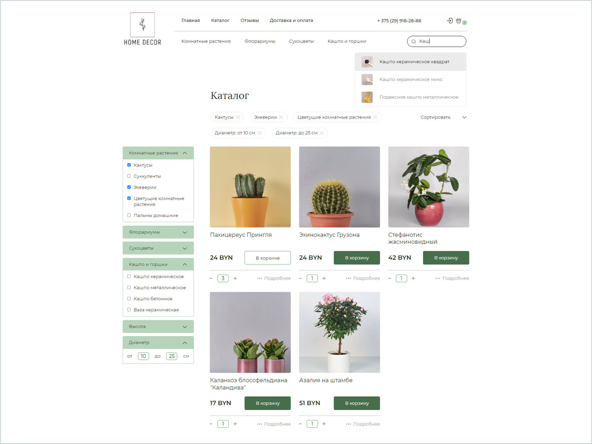

## 3. Платформа для блогов (Angular/NgRx), 2023
### Репозиторий проекта: **[платформа для блогов на Angular](https://github.com/batnd/spa-blog-platform)**

### Описание
Платформа для ведения блогов, размещения статей, выполненная на **фреймворке Angular + NgRx**.  
С возможностями, выполненными задачами, внешним видом и **технологиями** можно ознакомиться в репозитории проекта.

### Внешний вид
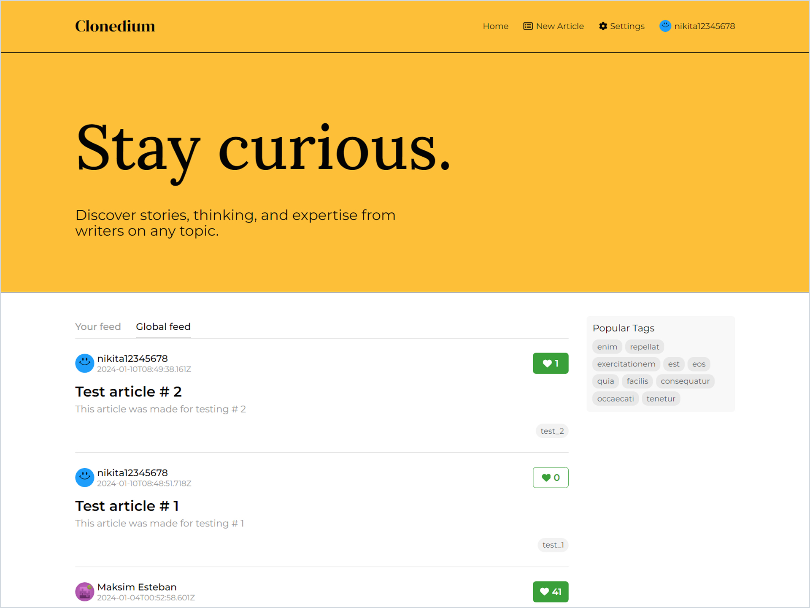

## 4. Приложение финансовый-менеджер (TypeScript), 2022
### Репозитории проектов: **[финансовый-менеджер на TypeScript](https://github.com/batnd/spa-financial-manager)**

### Описание
Приложение для управления личными финансами (финансовый менеджер) на **TypeScript**.  
С возможностями, выполненными задачами, внешним видом и **технологиями** можно ознакомиться в репозиториях проектов.

### Внешний вид
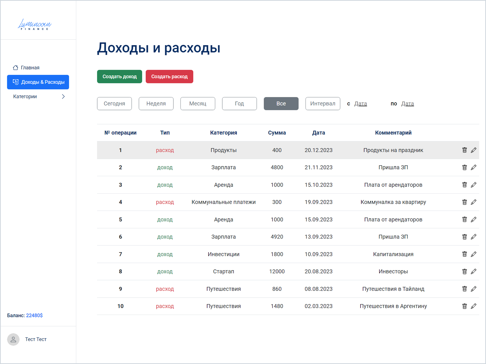

## 5. Quiz-викторина (Angular), 2022
### Репозитории проектов: **[quiz-викторина на Angular](https://github.com/batnd/spa-quiz-angular)**

### Описание
Веб-приложение для тестирования знаний в формате quiz-викторины, выполненное **Angular**.  
С возможностями, выполненными задачами, внешним видом и **технологиями** можно ознакомиться в репозиториях проектов.

### Внешний вид
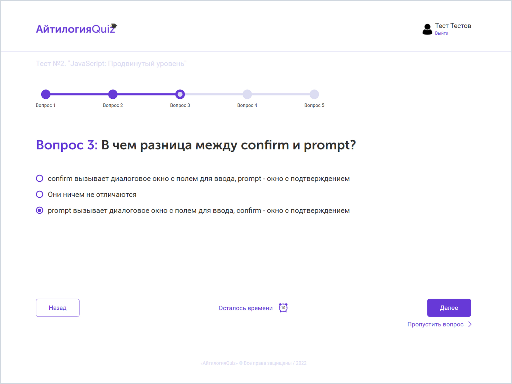

## 6. Игра "Memory Game" ("Найди пару") (Angular / React), 2022
### Репозитории проектов: **[игра "Memory Game" на Angular](https://github.com/batnd/game-memoryGame-angular)** | **[игра "Memory Game" на React](https://github.com/batnd/game-memoryGame-react)**

### Описание
Игра "Memory Game" (найди пару), выполненная на **Angular** и **React**.  
С возможностями, выполненными задачами, внешним видом и **технологиями** можно ознакомиться в репозиториях проектов.

### Внешний вид
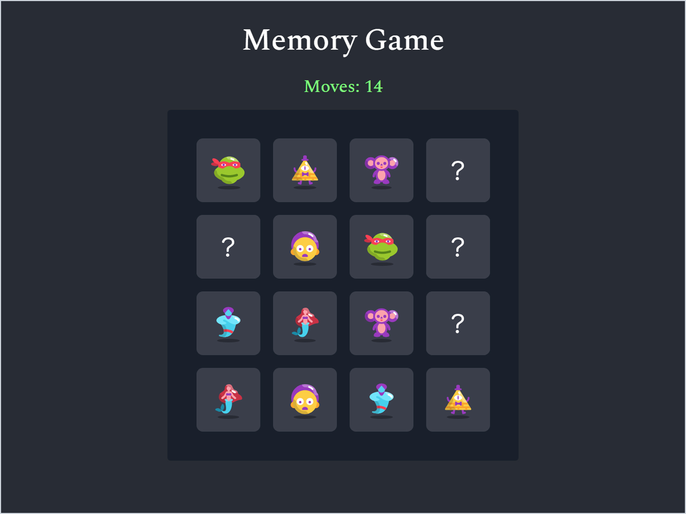

## 7. Игра "Tic-Tac-Toe" ("Крестики-нолики") (Angular / Vue.js), 2022
### Репозитории проектов: **[игра "Tic-Tac-Toe" на Angular](https://github.com/batnd/game-ticTacToe-angular)** | **[игра "Tic-Tac-Toe" на Vue.js](https://github.com/batnd/game-ticTacToe-vue)**

### Описание
Игра "Tic-Tac-Toe" (крестики-нолики), выполненная на **Angular** и **Vue.js**.  
С возможностями, выполненными задачами, внешним видом и **технологиями** можно ознакомиться в репозиториях проектов.

### Внешний вид
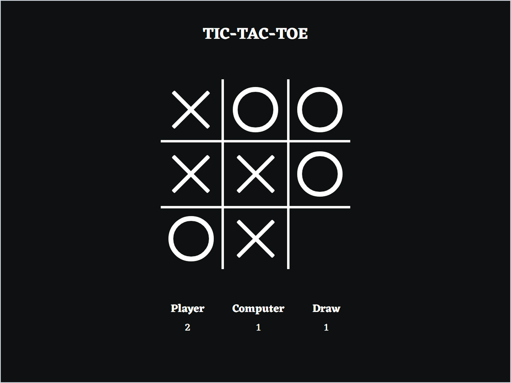

## 8. Лендинг для магазина с экзотическими фруктами, 2022
### Репозиторий проекта: **[лендинг для магазина с экзотическими фруктами](https://github.com/batnd/landing-fruit-shop)**

### Описание
Вёрстка и реализация функционала лендинга для магазина экзотических фруктов на **HTML, CSS(SCSS), JavaScript**.  
Лендинг **адаптивен** (от 320px).  
С возможностями, выполненными задачами, внешним видом и **технологиями** можно ознакомиться в репозитории проекта.

### Внешний вид **[(открыть демо)](https://batnd.github.io/landing-fruit-shop/)**
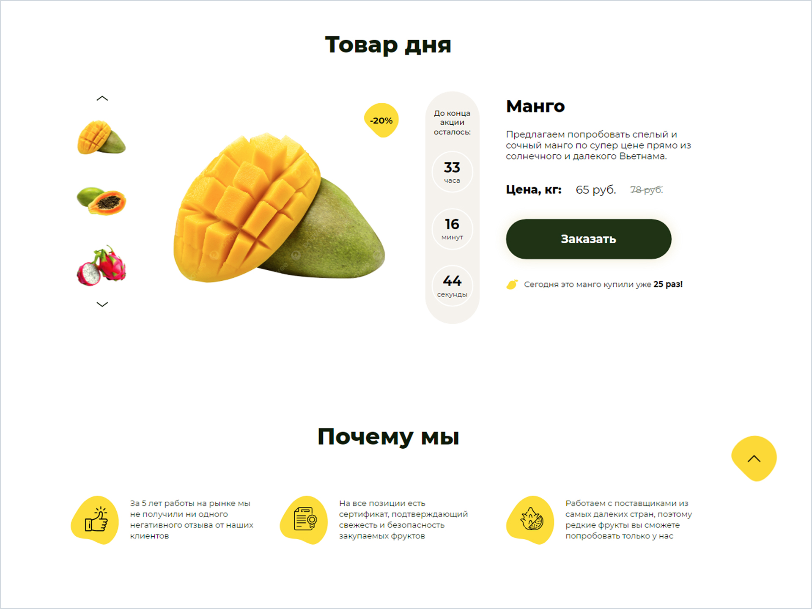

## 9. Лендинг для центра реабилитации, 2023
### Репозиторий проекта: **[лендинг для центра реабилитации](https://github.com/batnd/landing-rehab-center)**

### Описание
Лендинг для современного центра реабилитации, выполненный на **HTML, CSS(SCSS), JavaScript**.  
Лендинг **адаптивен** (от 320px).  
С возможностями, выполненными задачами, внешним видом и **технологиями** можно ознакомиться в репозитории проекта.

### Внешний вид **[(открыть сайт)](https://prokines.kz/)**
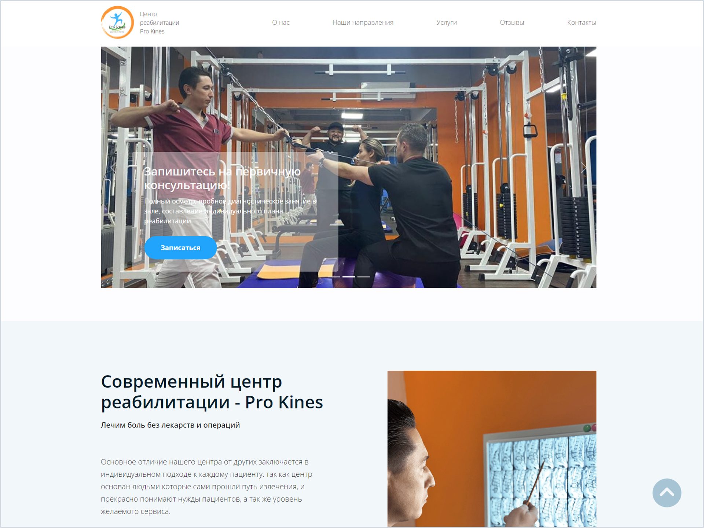

## 10. Игра - "Snake" (Змейка), 2022
### Репозиторий проекта: **[игра "Snake"](https://github.com/batnd/game-snake)**

### Описание
Игра "Snake" (змейка), выполненная на **JavaScript**.  
С возможностями, выполненными задачами, внешним видом и **технологиями** можно ознакомиться в репозитории проекта.

### Внешний вид
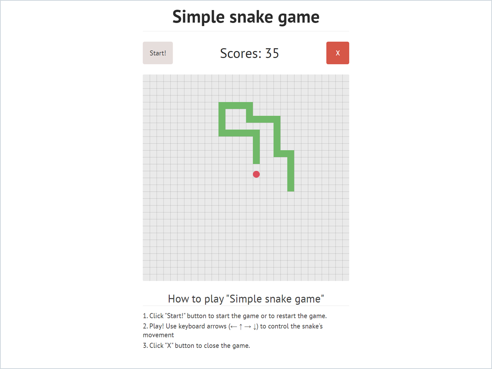

## 11. Веб-страница личного кабинета видео-хостинга, 2022
### Репозиторий проекта: **[веб-страница личного кабинета видео-хостинга](https://github.com/batnd/webpage-personal-account)**

### Описание
Вёрстка страницы личного кабинета для видео-хостинга, выполнена на **HTML, CSS**.  
С выполненными задачами, внешним видом и **технологиями** можно ознакомиться в репозитории проекта.

### Внешний вид
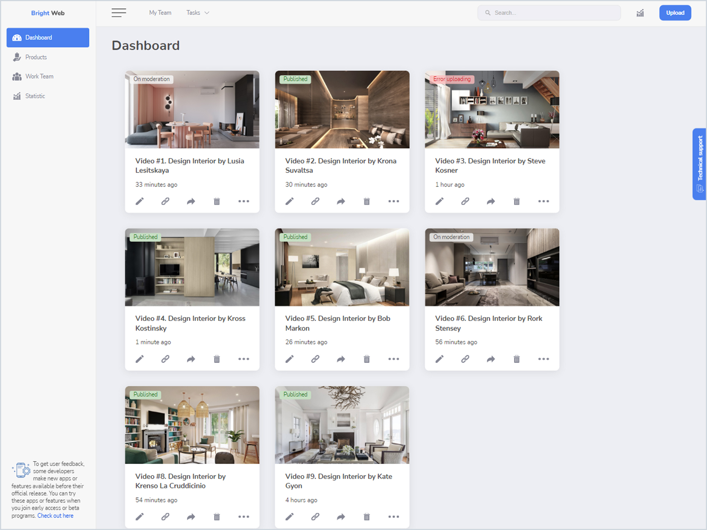

## 12. Лендинг магазина французской выпечки, 2022
### Репозиторий проекта: **[лендинг для магазина французской выпечки](https://github.com/batnd/landing-bakery-shop)**

### Описание
Вёрстка лендинга для магазина французской выпечки, выполнен на **HTML, CSS(Less), JavaScript**.  
Лендинг **адаптивен** (от 320px).  
С возможностями, выполненными задачами, внешним видом и **технологиями** можно ознакомиться в репозитории проекта.

### Внешний вид
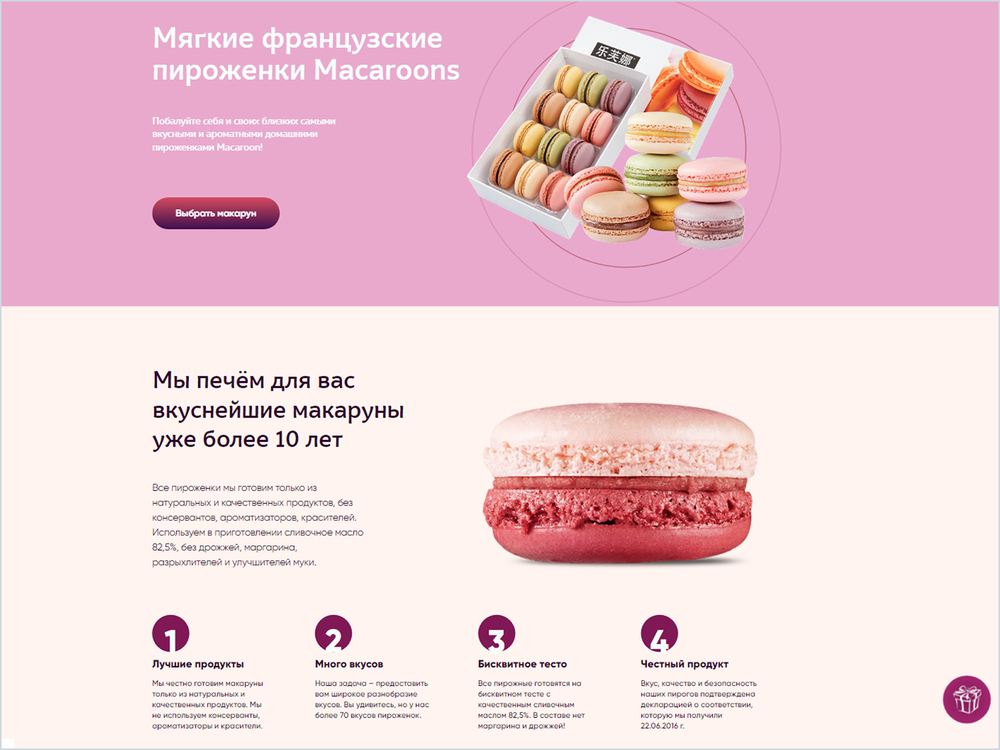

## 12. Веб-страница сайта магазина чая, 2022
### Репозиторий проекта: **[веб-страница магазина чая](https://github.com/batnd/webpage-tea-shop)**

### Описание
Вёрстка лендинга магазина чая, выполнена на **HTML, CSS + Bootstrap, JavaScript (jQuery)**.  
Веб-страница **адаптивна** (от 320px).  
С возможностями, выполненными задачами, внешним видом и **технологиями** можно ознакомиться в репозитории проекта.

### Внешний вид
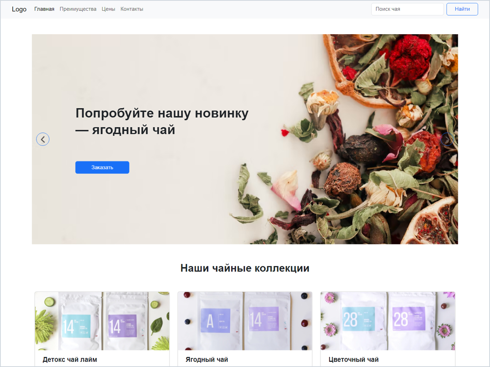